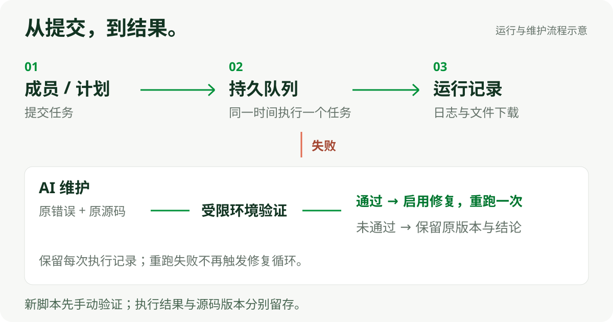

<p align="center">
  
</p>

# SpiderFly

把 Python 脚本交给一台共享 Windows 电脑。团队成员通过浏览器提交任务、安排每日或每周计划，在同一个地方查看日志、下载结果。**同一时间执行一个任务，其余任务进入持久队列。**

[开始部署](#开始部署) · [跑通一个示例](#跑通一个示例) · [使用说明](使用说明.md) · [AI 任务助手](docs/AI任务助手.md)

## 从一张表开始

仓库自带订单筛选脚本：上传 Excel，只保留“状态”为“待处理”的行，再下载新生成的结果。下面使用文档中的三条虚构订单，原表不改写。

<p align="center">
  
</p>

输入 `00123 / 待处理 / 0`、`00124 / 已完成 / 19.5`、`00125 / 待处理 / 42.5`，输出订单 **00123、00125**。结果保留原列和顺序；没有匹配行时仍生成表头。使用仓库里可上传运行的 [Python 脚本](examples/instruction_excel_filter_task.py)。

## 团队怎样使用

| 你要做的事 | SpiderFly 提供什么 |
| --- | --- |
| 让团队共用脚本 | 浏览器入口、独立账号、固定任务归属与操作记录 |
| 定时处理重复工作 | 手动、每日、每周触发，统一排队执行 |
| 找到某次运行的结果 | 完整运行记录、标准输出、错误日志、文件下载 |
| 管理脚本及依赖 | 每个任务独立 Python 环境，版本记录与回退 |
| 用自然语言准备任务 | AI 生成 Python 草稿，公开网页探索、数据提取与 CSV 下载 |
| 处理运行故障 | AI 分析错误，受限验证通过后启用修复并自动重跑一次 |

AI 使用可配置的 DeepSeek 服务。正常执行已保存的脚本不调用模型；创建、对话和故障维护才使用相应 AI 流程。人工提交的新版本验证通过后需确认使用，自动故障修复则按维护流程启用。

## 一条队列，完整保留运行过程

<p align="center">
  
</p>

1. **提交**：成员点击运行，或每日、每周计划到点入队。
2. **执行**：共享 Windows 宿主机逐个运行任务；排队等待不计入脚本执行时间。
3. **查看**：每次运行独立保存状态、日志和本次文件，可选飞书通知。
4. **维护**：失败后分析原源码与错误；验证通过才切换修复版本并重跑一次。未通过保留原版本和结论，重跑失败不会无限循环。

自动维护默认有滚动 24 小时预算，可在“AI 模型 → 调用与维护预算”开启“不限制累计维护预算”。实际用量继续记录，单次超时仍生效。详细行为见 [AI 任务助手](docs/AI任务助手.md)。

## 开始部署

**宿主机：Windows 10/11 + 64 位 Python 3.12。** 首次安装需要访问 PyPI 或公司包源。团队其他电脑只需浏览器，无需安装 Python。

```powershell
git clone https://github.com/flyyang12-rgb/spiderFly.git
cd spiderFly
.\start.bat
```

`start.bat` 创建平台虚拟环境、安装后端依赖并启动网页。仓库已包含构建好的前端，普通部署不需要 Node.js。之后日常双击 `SpiderFly.exe` 启动。

默认本机地址为 **http://127.0.0.1:8000**。首次登录信息保存在宿主机的 `data/首次登录信息.txt`，登录后为伙伴创建各自的账号。端口可在本机 `.env` 中调整。

需要局域网共享时，按 [部署与操作详解](docs/部署与操作详解.md#局域网访问) 配置防火墙，成员使用宿主机 IP 访问。支持可信局域网或私网环境，当前不提供开箱即用的公网 HTTPS 部署。

## 跑通一个示例

1. 创建 `.xlsx`，第一行是 `订单号`、`状态`、`金额`，填写上面的三条虚构订单；订单号按文本保存。
2. 在“管理中心 → 创建任务”上传 [instruction_excel_filter_task.py](examples/instruction_excel_filter_task.py)，依赖填写 `spiderfly-instructions==0.1.1`，并上传该 Excel 模板。
3. 选择手动触发，体验时关闭通知；等待“Python 就绪”后点击运行。
4. 在“运行中心 → 运行记录 → 本次文件”下载输入存档和 `订单筛选示例/结果.xlsx`，核对两条待处理订单。

所需 [0.1.1 wheel](release/instructions/spiderfly_instructions-0.1.1-py3-none-any.whl) 已在仓库中。更多列校验、空结果和输入文件规则见 [订单筛选示例](docs/平台筛选示例.md)。

想写自己的任务，可从 [独立流程模板](flows/README.md) 开始；六条公共指令覆盖文字合并、Excel 读写、单列筛选、均值计算和文件列表，见 [指令目录](docs/指令目录.md)。

## 使用前了解这些边界

- **单台宿主机、串行执行。** 当前不是多机分布式调度，也不并行启动多个桌面任务。
- **Python 环境与桌面软件分别准备。** Office、浏览器、驱动和业务登录不由 `requirements.txt` 安装；桌面自动化需要 Windows 用户保持登录，并满足相应桌面会话条件。
- **自动维护有运行环境边界。** 修复试跑与修复后执行使用准备好的 WSL Ubuntu 受限环境，不能承诺自动修复任意 Windows GUI、登录浏览器或未知依赖任务。
- **网页探索与定时任务不同。** 探索会话的登录状态不会自动转入定时脚本。公开采集支持范围见 [AI 采集环境](docs/AI采集环境.md) 与 [浏览器探索](docs/AI浏览器探索.md)。
- **上传脚本须可信。** 普通任务使用宿主机 Windows 账号权限。依赖影刀内部运行时的程序不能直接作为标准 Python 上传。
- **运行资料留在本机。** `data/`、`.env`、共享工作区、真实业务脚本和浏览器资料不进入公开仓库。备份方法见 [部署与操作详解](docs/部署与操作详解.md#数据与备份)。

## 文档与开发入口

| 入口 | 内容 |
| --- | --- |
| [使用说明](使用说明.md) | 账号、任务、定时、日志、结果和常见问题 |
| [部署与操作详解](docs/部署与操作详解.md) | 首次安装、登录自启、局域网、配置、备份 |
| [AI 任务助手](docs/AI任务助手.md) | 对话生成、自动维护、模型配置及预算 |
| [任务需求与版本](docs/任务需求与版本方案.md) | 上传、验证、确认使用、下载与回退 |
| [开发与验证](docs/开发与验证.md) | 隔离开发、测试和发布检查 |
| [AGENTS.md](AGENTS.md) / [CONTEXT.md](CONTEXT.md) | 协作约定与当前状态 |

源码位于 `backend/` 和 `frontend/src/`；已构建页面位于 `frontend/dist/`；Windows 启动器源码位于 `launcher/`。修改前端才需要 Node.js，测试必须使用隔离副本。完整目录与开发步骤见 [部署与操作详解](docs/部署与操作详解.md#目录说明)。

## 许可证

仓库目前未附带开源许可证。公开可见不代表已授予任意复制、修改或再发布的许可。
