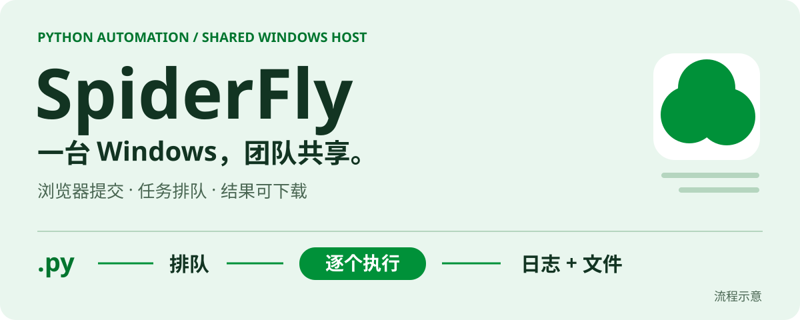
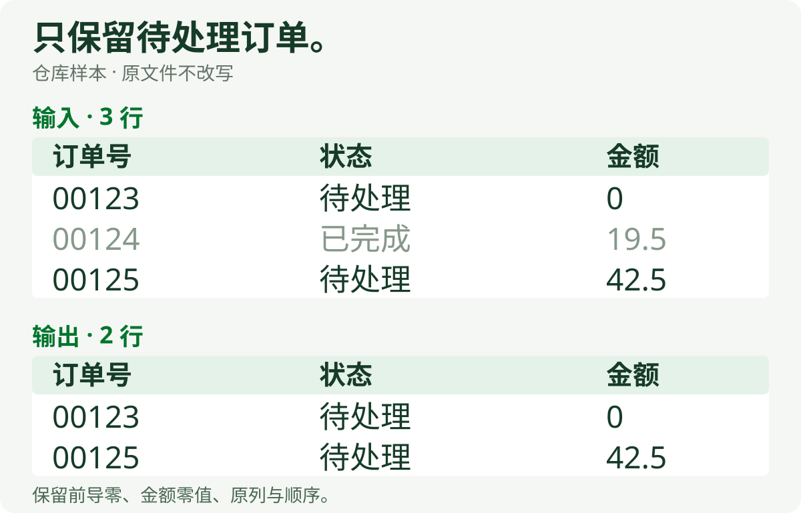
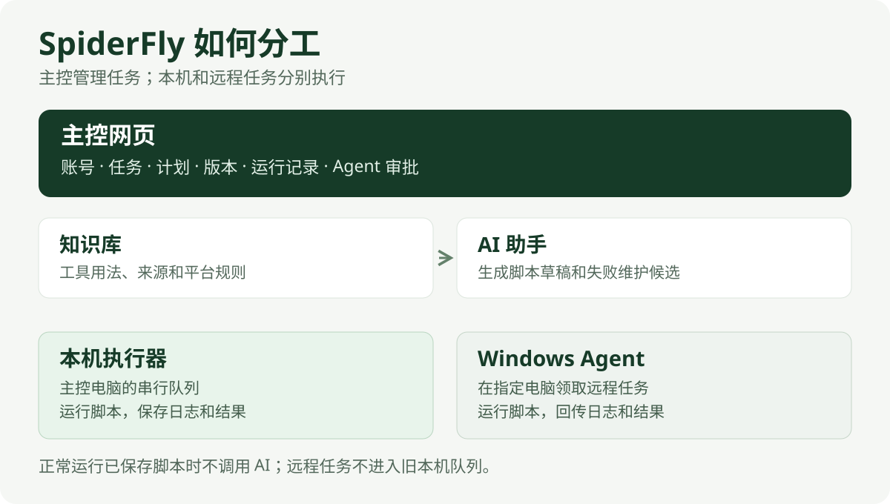

<p align="center">
  
</p>

# SpiderFly

团队共用一台 Windows 电脑运行 Python 自动化。成员在浏览器里提交任务、安排计划、查看日志和下载结果。**同一时间执行一个任务，其余任务进入持久队列。**

[快速开始](#快速开始) · [运行示例](#跑通订单筛选) · [项目架构](docs/项目架构.md) · [使用说明](使用说明.md) · [全部文档](docs/README.md)

## 从输入到结果

上传一张订单表，只保留“状态”为“待处理”的行。下面是仓库示例使用的虚构数据，原文件不改写。

<p align="center">
  
</p>

<details>
<summary>查看可复制的样本数据</summary>

| 订单号（文本） | 状态 | 金额 |
| --- | --- | --- |
| 00123 | 待处理 | 0 |
| 00124 | 已完成 | 19.5 |
| 00125 | 待处理 | 42.5 |

输出保留订单 `00123` 和 `00125`。

</details>

[order_filter.py](flows/order_filter.py) 是可直接上传的普通 Python 脚本。筛选条件写在代码里，没有匹配行时仍输出表头。你也可以使用自己的脚本处理表格、文件或网页数据。

## 团队日常工作

| 要做的事 | SpiderFly 提供什么 |
| --- | --- |
| 共用脚本 | 浏览器入口、独立账号、固定任务归属和操作记录 |
| 定时执行 | 手动、每日、每周触发，共用持久队列 |
| 找到结果 | 运行历史、标准输出、错误日志和本次文件下载 |
| 管理依赖与代码 | 任务独立 Python 环境、代码版本和回退 |
| 准备新任务 | AI 生成草稿、探索公开网页并提取数据 |
| 排查故障 | AI 在支持的受限环境验证修复，通过后启用并自动重跑一次 |

正常运行已保存脚本不调用模型。AI 创建、对话和故障维护使用配置的 DeepSeek 服务；自动修复仍受环境、超时和后台用量保护约束。

## 平台管调度，脚本管业务

<p align="center">
  
</p>

| 层 | 位置 | 责任 |
| --- | --- | --- |
| 平台 | `backend/app` · `frontend/src` | 接收任务、准备环境、串行执行、保存记录 |
| 业务脚本 | `flows` · 用户上传的 `.py` | 具体字段、条件、计算与采集逻辑 |
| 可选运行库 | `backend/spiderfly_runtime` | 输入副本、产物目录、回执及通用文件处理 |

新业务直接写 Python，可使用标准库、openpyxl 或可选运行库。旧指令框架已从当前源码移除，历史 wheel 仅用于兼容已有任务。详见 [项目架构](docs/项目架构.md)。

## 快速开始

**宿主机：Windows 10/11 + 64 位 Python 3.12。** 首次安装需要访问 Python 包源；成员电脑只需要浏览器。

```powershell
git clone https://github.com/flyyang12-rgb/spiderFly.git
cd spiderFly
.\start.bat
```

`start.bat` 准备平台环境并启动网页。默认本机地址为 `http://127.0.0.1:8000`，首次登录信息位于 `data/首次登录信息.txt`；之后日常双击 `SpiderFly.exe`。

仓库包含构建好的前端，普通部署无需 Node.js。团队访问与防火墙配置见 [部署指南](docs/部署与操作详解.md#局域网访问)。

## 跑通订单筛选

1. 创建 `.xlsx`，表头为 `订单号`、`状态`、`金额`，输入上图三行样本；订单号按文本保存。
2. 管理员上传 [order_filter.py](flows/order_filter.py)，依赖填写 `spiderfly-runtime==0.1.0`，并上传该 Excel 模板。
3. 选择手动触发，等待“Python 就绪”后运行。
4. 从“运行记录 → 本次文件”下载 `流程文件/输出/结果.xlsx`，核对保留的两条订单。

[运行库 wheel](release/runtime/spiderfly_runtime-0.1.0-py3-none-any.whl) 已随仓库提供。原输入副本保存在 `流程文件/输入.xlsx`。编写自己的任务从 [独立流程模板](flows/README.md) 开始。

## 使用边界

- **一台宿主机，串行执行。** 当前不提供多机 Agent 调度或多个桌面任务并行。
- **桌面软件独立准备。** Office、浏览器、驱动和业务登录不由 Python 依赖清单安装。
- **自动维护有环境范围。** 支持已准备的 WSL readonly-v1 / collection-v1；不承诺任意 Windows GUI、登录软件或未知依赖都能自动修复。新运行库尚未安装到 WSL。
- **探索会话与定时脚本分开。** 浏览器登录状态不会自动转入定时脚本。
- **运行资料留在宿主机。** 真实配置、任务、业务文件和账号不进入仓库；升级前按 [备份与恢复](使用说明.md#十二备份和换电脑恢复) 操作。

## 文档入口

[使用说明](使用说明.md) · [部署详解](docs/部署与操作详解.md) · [AI 任务助手](docs/AI任务助手.md) · [运行库接口](backend/RUNTIME.md) · [开发与验证](docs/开发与验证.md) · [维护约定](AGENTS.md)

完整索引见 [docs](docs/README.md)。当前状态与本机待发布改动见 [CONTEXT](CONTEXT.md)。

仓库暂未附带开源许可证；公开可见不代表已经授予任意复制、修改或再发布的许可。
