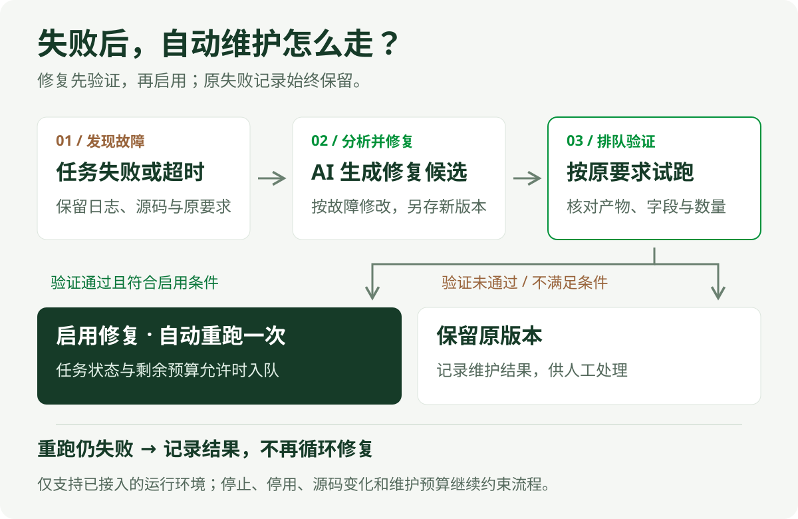

<p align="center">
  
</p>

# SpiderFly

SpiderFly 是面向 Windows 小团队的 Python 自动化调度平台。管理员在一台主控电脑上通过网页管理任务，局域网内获批的 Agent 电脑负责运行浏览器、Excel 或普通 Python 脚本，执行进度、日志、结果文件和失败状态统一回到主控。

**主控和 Agent 都提供图形化首次安装入口。普通使用者不需要编辑 `.env`，也不需要输入 PowerShell 命令。**

[两台电脑开始使用](#两台电脑开始使用) · [调度模式](#调度模式怎么工作) · [已有能力](#已经实现什么) · [真实案例](#真实验证过的-ai-采集案例) · [使用边界](#使用边界) · [完整文档](docs/README.md)

> [!IMPORTANT]
> 多宿主机源码和隔离回归已经完成，但两台真实 Windows 电脑的现场验收仍待进行。建议先在可信局域网用非关键任务试运行，再用于正式业务。[查看阶段 7 验收清单](docs/多宿主机阶段7发布与双机验收.md)

## 两台电脑开始使用

### 1. 在电脑 A 安装主控

电脑 A 需要 Windows 10/11、64 位 Python 3.12，以及首次安装依赖时可访问 Python 包源。

```powershell
git clone https://github.com/flyyang12-rgb/spiderFly.git
cd spiderFly
.\安装并启动主控.bat
```

安装向导会检查 Python、设置访问端口，并询问是否允许可信局域网访问。完成后自动打开管理页面。默认端口为 `8000`，首次登录信息写在 `data/首次登录信息.txt`。

以后启动主控可双击 `SpiderFly.exe`。管理员也可以使用 `scripts/spiderfly-controller.ps1` 完成状态检查、日志查看、备份、恢复和人工升级。

### 2. 从主控页面准备电脑 B

登录主控页面后进入“宿主机”：

1. 点击“生成一次性接入码”。
2. 点击“下载 Agent 安装包”。
3. 把 ZIP 发到电脑 B；接入码只供一台电脑使用，并有有效期。

电脑 B **不需要克隆整个仓库**，也不需要主控数据库、模型配置或知识库。

### 3. 在电脑 B 接入 Agent

电脑 B 需要 Windows 10/11。若没有 64 位 Python 3.12，Agent 安装向导可自动从 python.org 下载 Python 3.12.10，为当前用户安装并配置 PATH；安装需要联网，任务使用的其他桌面软件仍需单独准备。

1. 解压 Agent ZIP。
2. 双击 `安装并接入Agent.bat`。
3. 如果提示未检测到 Python，点击“自动安装 Python 3.12”，等待向导显示“已就绪”；已检测到则跳过。
4. 填写主控地址，例如 `http://192.168.1.50:8000`，点击“检查连接”。
5. 填写一次性接入码和容易辨认的电脑名称，点击“安装并申请接入”。
6. 等待电脑 A 的管理员在“宿主机”页面批准。

向导可设置“登录 Windows 后自动启动 Agent”。批准后，Agent 状态会显示在 Windows 托盘和主控页面中。若自动安装失败，检查 B 电脑 `%TEMP%\SpiderFlyAgent-python-install.log`；向导不会绕过下载或签名验证错误。

在任务编辑页把“默认运行电脑（手动和计划）”设为 B，然后从任务中心点“运行”；页面会打开 B 的远程运行记录。B 离线时任务留在 B 排队，不会改投 A。历史未绑定任务仍在 A 本机运行。“宿主机”页只负责电脑接入、状态和远程运行记录，不再提供第二个运行入口。界面变更是否已在正式服务加载，以发布记录为准。

## 调度模式怎么工作

一台 Agent 只有同时满足以下条件才会领取任务：

```text
管理员已批准
    + 主控页面允许调度
    + Agent 托盘开启调度
    + Windows 用户已登录且桌面会话可用
    = 可以接收任务
```

电脑 B 的使用者可以随时从托盘切换“开启调度”或“非调度”。任务运行期间不能直接关闭调度；需要先停止任务，或使用“紧急接管”结束本次任务并拿回桌面控制权。

每台 Agent 同一时间只执行一个任务。不同 Agent 可以分别领取各自的任务。锁屏、注销或桌面会话不可用时不会领取新的桌面任务。

## 已经实现什么

| 场景 | SpiderFly 的处理 |
| --- | --- |
| 手动运行 | 管理员在任务中心设置默认运行电脑并点击“运行” |
| 定时分发 | 每天或每周把冻结版本分发给绑定的 Agent |
| 任务执行 | Agent 为脚本和依赖准备独立环境，按单机串行方式运行 |
| 过程查看 | 回传 stdout、stderr、结构化进度和运行状态 |
| 结果回收 | 回传限定数量与大小的产物，统一从主控下载 |
| 停止与接管 | 主控停止、本机停止或托盘紧急接管，只处理本次进程组 |
| 断线恢复 | 本地 journal 保留事件和结果，恢复连接后继续补传 |
| 失败处理 | 生成 AI 维护候选，由管理员确认后使用新版本重新运行 |
| 发布运维 | 主控和 Agent 提供状态、日志、备份、恢复和人工升级入口 |

任务代码、依赖、宿主机和调度规则在分发时冻结；后续修改不会悄悄改变已经排队的运行。

## 真实验证过的 AI 采集案例

> 用 DP 创建知乎周榜前五条采集任务，并自动试跑。

已完成一次真实链路验证：**读知识 → DP 查看页面 → 生成 Python → 自动试跑 → 输出 5 条 CSV**。该次验证约 33 秒、6 次模型调用，页面观察和脚本试跑使用普通任务配置端口 `9123`。

这是一个指定网站的真实验证，不代表所有网站都能稳定采集。登录、验证码、网站变化、字段正确性和业务完整性仍需人工核对。[查看验证记录](docs/DP创建与试跑验证_2026-09-11.md)

## AI 创建与失败维护

已有脚本可以直接上传。需要创建采集任务时，AI 可以参考项目知识库、观察目标页面、生成 Python 草稿并试跑；只有用户选择“使用草稿”后才保存为任务。正常运行已保存脚本时不调用模型。

<p align="center">
  
</p>

执行失败或超时后，平台可以分析日志并生成修复候选。验证通过后按配置启用并最多重跑一次；原失败记录保留，重跑失败不会无限循环。修复不得删除业务校验或放宽原要求。[查看版本与修复规则](docs/功能地图/版本与修复.md)

## 系统如何分工

<p align="center">
  
</p>

- **主控网页**保存用户、任务、计划、版本、日志和结果，负责审批 Agent 与分发任务。
- **知识库与 AI**提供资料检索、脚本草拟、页面观察、试跑和维护候选。
- **本机执行器**继续支持主控电脑上的单机 Python 任务。
- **Windows Agent**在其他电脑执行指定的远程任务，并将过程和结果签名回传。

## 使用边界

- **网络范围：**首版面向可信局域网。HTTP 签名可以校验身份和内容，但不会加密任务代码和日志；跨局域网建议使用 Tailscale 或公司 VPN，不要直接开放公网端口。
- **电脑角色：**当前正式 Agent 应安装在第二台电脑；主控旧本机执行器与 Agent 使用共享互斥锁，不能通过改数据目录绕过。
- **桌面任务：**浏览器、Excel 和其他桌面自动化需要对应 Windows 用户保持登录，锁屏、注销、RDP 断开和休眠需要按现场环境验收。
- **执行权限：**Agent 和普通 Python 任务使用当前 Windows 账号权限，进程组管理不是安全沙箱。只批准可信人员维护的脚本。
- **运行并发：**每台 Agent 单任务串行；不同 Agent 可以独立运行。主控上的受限环境和本机任务仍遵循各自队列规则。
- **可选能力：**AI 需要模型配置；Scrapling 受控试跑需要 WSL 环境；DrissionPage 需要在平台 Python 环境安装 `backend/requirements-dp.txt` 并准备 Edge 或 Chrome。
- **业务验收：**语法通过、脚本报告完成或 AI 验证通过，都不能替代对字段、数量、登录态和最终文件的人工检查。
- **数据位置：**账号、任务、密钥、运行文件和 Agent 身份留在本机数据目录，不进入 Git。升级或迁移前先执行备份。

## 验证状态

- 后端隔离回归：435 项，417 通过、18 项因 Chromium、WSL、原生 DP 或权限条件跳过。
- Agent：48 项，47 通过、1 项因当前 Windows 账号无符号链接权限跳过。
- 宿主机 API：59 项全部通过。
- 主控和 Agent 的 PowerShell 5.1 语法、备份恢复、升级与合成安全启停已验证。
- 尚未完成：两台真实 Windows 的浏览器/Excel、锁屏、RDP、断网、崩溃和恢复矩阵。

详细证据见[阶段 7 发布准备验证](docs/多宿主机阶段7发布准备验证_2026-09-21.md)和[双机验收指南](docs/多宿主机阶段7发布与双机验收.md)。

## 文档入口

| 需要了解什么 | 文档 |
| --- | --- |
| 普通使用 | [使用说明](使用说明.md) |
| Agent 安装与运维 | [Agent README](agent/README.md) |
| 宿主机和远程运行 | [功能地图](docs/功能地图/宿主机与远程运行.md) |
| 主控部署、备份和恢复 | [部署与操作详解](docs/部署与操作详解.md) |
| Agent 通信边界 | [Agent 协议 v1](docs/Agent协议_v1.md) |
| 项目结构 | [项目架构](docs/项目架构.md) |
| 开发与验证 | [开发与验证](docs/开发与验证.md) |
| 当前加载状态 | [CONTEXT](CONTEXT.md) |

## License

仓库目前尚未附带开源许可证。除非仓库所有者另行授权，否则公开可见不等于允许复制、修改或分发。
