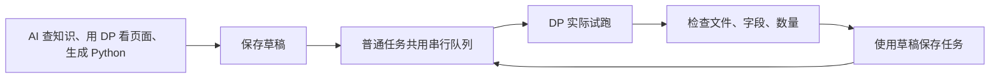

# DP 创建与试跑

在 AI 对话里说“用 DP 创建采集任务并试跑”即可选择 DP。Scrapling 仍可使用，AI 按需求选；指定 DP 时不自动换引擎。

| 你关心的事 | 行为 |
| --- | --- |
| 调试时端口 | 读取普通任务 `SPIDERFLY_BROWSER_PORT`，默认 `9123` |
| 保存后端口 | 同一配置、同一执行器；不随机分配 |
| 端口被占用 | 等待或报错，不接管、不关闭其他程序 |
| 谁开关浏览器 | 平台启动本次无头 Edge/Chrome，只关闭本次进程树 |
| 是不是同一个浏览器 | 单次运行中脚本连接平台启动的浏览器；下一次重新启动，不继承登录态 |
| 脚本语言 | 普通 Python，调用原生 DrissionPage |
| 正常定时执行 | 运行已保存脚本，不再次调用 AI |

部署需要在平台 Python 环境安装 `backend/requirements-dp.txt`，版本固定为 4.1.1.4。DP 运行在 Windows 子进程，权限与普通任务一样，不是 WSL 安全沙箱。适用于已授权的任务源码。

代码已接入工作区；正式服务是否已加载以 [当前状态](../../CONTEXT.md) 为准。AI 知识入口：[平台 DP 规则](../../backend/ai_knowledge/drissionpage/runtime.md)。

## 对应 Python

[dp_probe.py](../../backend/app/dp_probe.py)、[dp_runtime.py](../../backend/app/dp_runtime.py)、[dp_driver.py](../../backend/app/../native/dp_driver.py)。职责与调用关系见 [知识框架对照](知识框架与代码对照.md)。
