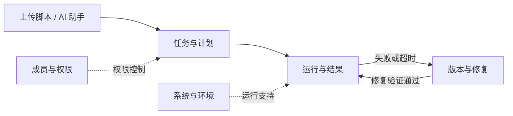

# 功能地图

先看 [知识框架与 Python 对照](知识框架与代码对照.md)：按模块把说明文档、知识资料和实现文件对应起来。

给项目负责人看的简明说明。以后直接用下面的模块名称提问题即可，例如：“运行与结果：取消排队后，页面怎么显示？”

这套文档按当前工作区整理；工作区有未发布改动，正式运行版本另见 [当前状态](../../CONTEXT.md)。主要页面与接口已按模块拆分，技术位置见 [代码对照与模块结构](../开发/代码对照与拆分方案.md)。

| 模块 | 负责什么 |
| --- | --- |
| [任务与计划](任务与计划.md) | 创建任务、修改设置、安排执行时间 |
| [运行与结果](运行与结果.md) | 排队、执行、停止、日志和结果下载 |
| [AI 助手](AI助手.md) | 理解需求、探索网页、生成和修改脚本；[DP 任务](DP任务.md) |
| [版本与修复](版本与修复.md) | 管理脚本版本、验证修改、修复失败 |
| [成员与权限](成员与权限.md) | 登录、成员管理、权限和操作审计 |
| [系统与环境](系统与环境.md) | 准备 Python 环境、模型设置、通知和宿主机 |
| [宿主机与远程运行](宿主机与远程运行.md) | 工作区增量：审批 Windows Agent、手动派发、日志产物及失败候选；未部署 |

每篇只写职责、流程和关键规则。功能调整时同步更新对应文档；技术细节与验证记录留在开发文档里。文档描述行为，实际是否完成仍需代码和验证结果支持。
