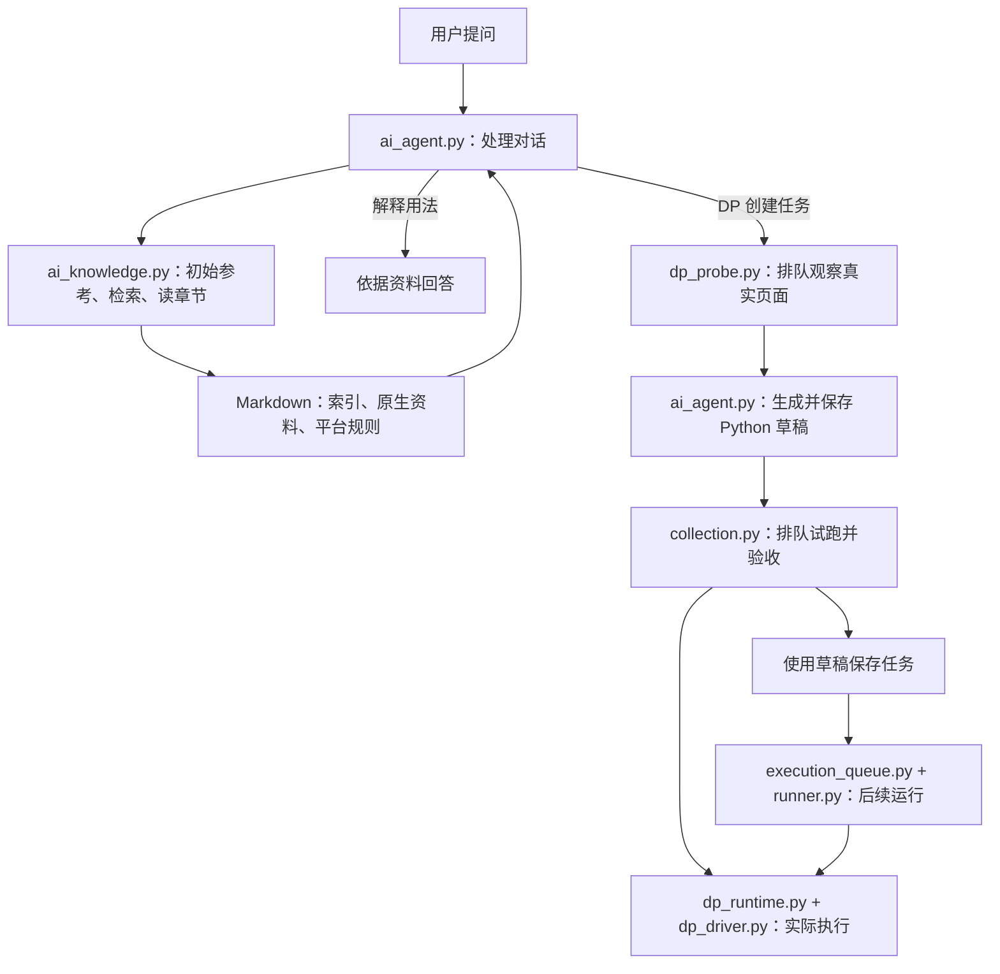

# 知识框架与 Python 对照

你看功能文档提问题，我按同一行找到 Python 实现。文档描述当前行为；改代码时同步该行对应的文档。当前是工作区状态，正式服务加载情况见 [CONTEXT](../../CONTEXT.md)。

## 项目模块对照

| 模块 | 给你看的文档 | 对应 Python 入口 | 负责什么 |
| --- | --- | --- | --- |
| 任务与计划 | [任务与计划](任务与计划.md) | [tasks.py](../../backend/app/api/tasks.py)、[scheduling.py](../../backend/app/scheduling.py) | 创建、编辑、定时触发 |
| 运行与结果 | [运行与结果](运行与结果.md) | [execution_queue.py](../../backend/app/services/execution_queue.py)、[runner.py](../../backend/app/runner.py) | 排队、运行、停止；结果与日志入口见 [executions.py](../../backend/app/api/executions.py) |
| AI 助手 | [AI 助手](AI助手.md) | [ai_agent.py](../../backend/app/ai_agent.py)、[ai_tools.py](../../backend/app/ai_tools.py) | 理解问题、选择工具、生成草稿 |
| 采集知识库 | [采集知识库](采集知识库.md) | [ai_knowledge.py](../../backend/app/ai_knowledge.py) | 按工具和主题找资料、读取章节 |
| DP 任务 | [DP 任务](DP任务.md) | [dp_probe.py](../../backend/app/dp_probe.py)、[dp_runtime.py](../../backend/app/dp_runtime.py)、[dp_driver.py](../../backend/native/dp_driver.py) | 看页面、执行脚本、管理本次浏览器 |
| 版本与修复 | [版本与修复](版本与修复.md) | [task_versions.py](../../backend/app/task_versions.py)、[maintenance.py](../../backend/app/maintenance.py) | 验证、切换版本、修复与重跑 |
| 成员与权限 | [成员与权限](成员与权限.md) | [users.py](../../backend/app/api/users.py)、[security.py](../../backend/app/security.py) | 账号、角色、操作权限 |
| 系统与环境 | [系统与环境](系统与环境.md) | [config.py](../../backend/app/config.py)、[environments.py](../../backend/app/environments.py)、[host_runtime.py](../../backend/app/host_runtime.py) | 配置、依赖、宿主机占用检查 |
| 宿主机与远程运行 | [宿主机与远程运行](宿主机与远程运行.md) | [hosts.py](../../backend/app/api/hosts.py)、[host_dispatch.py](../../backend/app/services/host_dispatch.py)、[remote_maintenance.py](../../backend/app/remote_maintenance.py)、[client.py](../../agent/spiderfly_agent/client.py)、[worker.py](../../agent/spiderfly_agent/worker.py) | 审批、签名通信、租约、远程执行、回传及失败候选；未部署 |

上表是主要入口；页面、接口及辅助文件的完整位置在 [开发对照表](../开发/代码对照与拆分方案.md)。

## 采集知识怎么对应代码

| 层次 | 文档或知识位置 | 对应 Python | 分工 |
| --- | --- | --- | --- |
| 知识索引 | [采集总索引](../../backend/ai_knowledge/collection_index.md) | [ai_knowledge.py](../../backend/app/ai_knowledge.py) 的 search、read、bootstrap | 索引说明去哪查，代码负责找章节和返回来源 |
| 原生 API 资料 | [Scrapling 概览](../../backend/ai_knowledge/scrapling/overview.md)、[DP 资料目录](../../backend/ai_knowledge/drissionpage/catalog.md) | [ai_knowledge.py](../../backend/app/ai_knowledge.py)；DP 导入由 [导入脚本](../../scripts/import_drissionpage_knowledge.py) 负责 | 资料解释第三方库，不逐篇生成一个平台 PY |
| Agent 调用规则 | [知识库维护](../开发/采集知识库维护.md) | [ai_tools.py](../../backend/app/ai_tools.py)、[ai_agent.py](../../backend/app/ai_agent.py) | 注册查资料工具，由 Agent 调用、补读并决定下一步 |
| DP 平台约定 | [DP 执行规则](../../backend/ai_knowledge/drissionpage/runtime.md) | [dp_probe.py](../../backend/app/dp_probe.py)、[dp_runtime.py](../../backend/app/dp_runtime.py)、[dp_driver.py](../../backend/native/dp_driver.py) | 约定如何连接；代码落实端口、归属、观察、运行和关闭 |
| 保存与试跑 | [DP 任务](DP任务.md)、[AI 助手](AI助手.md) | [ai_agent.py](../../backend/app/ai_agent.py) 的 save_draft、[collection.py](../../backend/app/collection.py) | 保存模型生成的 PY，按运行标记选择执行器并验收 |
| 验证证据 | [DP 验证记录](../DP创建与试跑验证_2026-09-11.md) | [test_dp_runtime.py](../../backend/tests/test_dp_runtime.py)、[test_ai_knowledge.py](../../backend/tests/test_ai_knowledge.py) | 检查行为与文档是否一致，不把历史测试当作正式服务已生效 |

## AI 收到问题以后

例如你问“DP 调试为什么用了别的端口”，对应 [DP 任务](DP任务.md) 的端口条目，检查 config.py、dp_runtime.py 和 dp_driver.py；问“AI 为什么没查资料”，对应 [采集知识库](采集知识库.md)，检查 ai_agent.py、ai_tools.py 和 ai_knowledge.py。

## 采集进度

执行详情显示脚本上报的阶段、页码、数量、失败与完整性；未知总量不估算百分比。上报协议和对应 Python 入口见 [采集进度与结果](../采集进度.md)。
