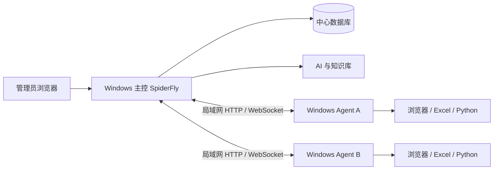

# SpiderFly 多宿主机调度需求

状态：目标需求已确认，分阶段实施中。2026-09-22 补充“任务中心手动运行必须遵守所选电脑”，对应本地源码已修改，正式主控尚未加载、A/B 现场未验收；实际进度见[宿主机与远程运行](功能地图/宿主机与远程运行.md)。
范围：第一阶段仅支持同一局域网内的一台 Windows 主控电脑和多台 Windows 宿主机。
原则：SpiderFly 是唯一主产品；相邻 `kk-rpa-*` 项目仅作为设计与实现参考，不形成并列产品。
参考实现验证：[多宿主机调度参考实现对照验证](多宿主机调度参考实现对照验证_2026-09-20.md)。

## 1. 目标

SpiderFly 从“网页、数据库和执行器都在同一台 Windows 电脑”的单机平台，演进为“Windows 主控 + 多台 Windows Agent”的集中调度平台。

管理员在主控网页中管理任务、版本、计划、宿主机、运行记录、AI 对话和知识库。新宿主机安装 SpiderFly Agent 后申请加入，经管理员批准并切换到调度模式，便可接收任务、在本机运行并回传状态、日志和结果。



第一阶段要证明的最小闭环是：新机器注册并获批、切换调度模式、接收一个任务版本、运行、实时回传日志和结果，并能在断线或重启后恢复到明确状态。

## 2. 当前状态与目标状态

| 项目 | 当前状态 | 目标状态 |
| --- | --- | --- |
| 主控 | A 电脑运行 FastAPI、前端、SQLite 及旧本机执行器，同时已有宿主机管理和远程记录接口 | 继续运行在一台 Windows 主控电脑；本机执行器最终也走 Agent 协议 |
| 执行 | A 本机旧队列与 B 等远程 Agent 链路并存；计划绑定和宿主机页分发能选 B。任务中心手动按目标路由已在本地源码实现，正式 A 主控仍待加载与双机验收 | 手动、计划和直接分发均按本次选定电脑执行；每台 Agent 串行 |
| 数据 | 主控保存账号、任务、版本、本机执行和远程运行等中心数据；Agent 仅保留本机运行所需缓存 | 账号、任务、版本、队列和汇总记录集中在主控 |
| AI 与知识库 | 位于 SpiderFly 主控，远程失败维护仍分阶段接入 | 只位于主控，不下发模型密钥和完整知识库 |
| 新机器 | B 电脑已通过 Agent 申请并获批；用户报告有任务执行成功，但该次实际执行电脑须以运行记录核对，完整两机故障矩阵未验收 | 只安装 Agent，经批准后接收任务 |
| 网络 | A 已在局域网监听，B 通过局域网地址接入 | 第一阶段局域网 Agent 通信；公网后续扩展 |

部分多宿主机能力已实现；手动路由的本地源码和正式服务、完整两机验收仍须分开记录。现有单机调度与运行数据必须保留，迁移期间不得把规划写成当前能力。

## 3. 角色与组件

### 3.1 主控 SpiderFly

主控负责：

- 用户、权限、审计和站内通知；
- 宿主机登记、批准、撤销、在线状态和调度状态；
- 应用、任务、触发规则和不可变版本；
- 运行排队、指定宿主机、停止和结果汇总；
- AI 创建任务、知识库检索和 AI 维护建议；
- 模型配置与密钥；
- 日志、截图和产物的索引及下载权限。

主控电脑可以同时安装本机 Agent。即使两个组件运行在同一台物理电脑上，也必须通过同一 Agent 协议执行，不能为本机保留另一套隐式执行规则。

### 3.2 Windows Agent

Agent 负责：

- 申请注册并保存本机独立身份；
- 上报心跳、版本、在线状态、调度模式和当前占用；
- 接收指定的任务版本与本次运行参数；
- 校验任务包哈希，缓存代码和 Python 环境；
- 安装 `requirements.txt` 中的 Python 依赖；
- 在当前交互式 Windows 用户会话中执行桌面任务；
- 回传日志、进度、截图、状态和结果文件；
- 执行停止、清理、断线重连和重复下发去重。

Agent 不保存模型密钥、完整知识库、其他任务源码、主控数据库或 SpiderFly 用户数据。

桌面自动化不能只依赖 Windows 服务的 Session 0。实现时应区分后台连接/更新组件与登录用户会话中的托盘及执行组件；没有可用的交互式会话时，桌面任务不得显示为可执行。

### 3.3 管理员

第一阶段只有管理员可以：

- 上传或创建代码版本；
- 批准、撤销和管理宿主机；
- 分发、停止和重新运行任务；
- 查看完整技术日志、源码和 AI 候选差异；
- 确认使用 AI 候选版本。

普通成员的运行与结果权限沿用现有账号模型，不能获得任意 Python 上传或候选版本启用权限。

## 4. 宿主机接入

### 4.1 注册流程

1. 管理员在主控网页生成短期、一次性接入码。
2. 新电脑安装或启动 SpiderFly Agent，填写可配置的主控地址与接入码。
3. Agent 在本机生成密钥对，只向主控提交公钥、机器名称和必要的系统标识。
4. 主控显示“待批准宿主机”。
5. 管理员核对信息并批准或拒绝。
6. 批准后，主控为该机器签发独立长期凭据；接入码立即失效。
7. 管理员可单独撤销、轮换某台机器的凭据。Agent 重装后按新机器重新批准。

接入码建议 10 至 30 分钟过期且只能成功使用一次。所有生成、批准、拒绝、轮换和撤销操作写入审计记录。

### 4.2 网络范围

第一阶段只使用局域网，不建设公网域名、反向隧道或云数据库。Agent 使用可配置地址，例如：

```text
SPIDERFLY_SERVER_URL=http://192.168.1.50:9356
```

不能把具体局域网 IP 写死在协议或数据中。后续改成 HTTPS 公网地址时，注册、心跳、任务包和运行协议不应重写。数据库、Windows 远程桌面、共享目录和浏览器调试端口均不得对 Agent 网络开放。

## 5. 调度模式与桌面体验

宿主机至少有以下状态：

| 状态 | 接受新任务 | 含义 |
| --- | --- | --- |
| 待批准 | 否 | 已申请，管理员尚未批准 |
| 非调度 | 否 | Agent 在线，电脑由人正常使用 |
| 调度空闲 | 是 | 可领取指定给本机的下一项任务 |
| 运行中 | 否 | 本机已有任务，占用保持到明确收尾 |
| 停止中 | 否 | 已收到停止要求，尚未确认执行结束 |
| 离线 | 否 | 心跳超时或连接断开 |
| 状态待确认 | 否 | 无法确认旧进程是否结束，不得启动下一项桌面任务 |

任务运行时不使用 Windows 锁屏，也不以全屏黑色窗口覆盖任务界面。浏览器、Excel 和桌面软件保持可见，顶部状态条显示任务名称、当前步骤、耗时、停止和紧急接管入口。纯 Python、接口或文件处理任务可只显示托盘状态。

需要桌面的任务运行期间可限制普通鼠标键盘输入，但必须满足：

- 有明确的紧急接管方式；
- 停止、Agent 崩溃、用户注销或超时后自动解除；
- 保护层和状态条不能遮挡图像识别、截图或点击目标；
- “已请求停止”与“已经停止”分开显示；
- 首版先保证任务执行正确，再启用输入限制。

## 6. 任务创建与上传

### 6.1 人工上传

第一阶段任务代码只接受：

- 一个入口 `.py` 文件；
- 一个可选的 `requirements.txt`；无第三方依赖时可不上传或留空。

任务名称、说明、超时、触发规则和目标宿主机在网页填写。业务参数、凭据和本次输入文件不写入源码或依赖文件，由主控在运行时单独提供。

上传阶段不安装依赖、不运行代码、不进行语法或业务验证。只做文件边界检查：管理员权限、允许的文件类型、大小限制、安全文件名和路径、禁止覆盖平台文件。依赖其他本地 `.py`、图片或工程资源的任务不属于第一阶段单文件范围，应明确提示，后续再支持工程包或 Git 来源。

### 6.2 AI 创建任务

AI 创建任务保留为主控能力：

1. 管理员通过对话描述需求。
2. AI 检索主控知识库并按需读取专题资料。
3. AI 生成入口 `.py`、`requirements.txt` 和简要说明。
4. 页面展示生成内容，由管理员确认创建。
5. 确认后保存为该任务的第一个不可变版本。
6. 管理员选择宿主机并实际运行；不要求创建前自动试跑。

若创建任务需要观察真实网页，后续可把受控观察请求派给选定 Agent；这不是第一阶段注册与普通任务分发闭环的前置条件。

## 7. 版本模型

版本使用不可变的连续序号 `v1、v2、v3……`。内部保存整数顺序，页面显示 `vN`。

以下变化创建下一个版本：

- `.py` 内容变化；
- `requirements.txt` 内容变化；
- AI 生成新的参考候选代码；
- 管理员手工修改代码或依赖；
- 回退历史代码时，将目标内容复制为新的后续版本。

任务名称、触发规则、说明和目标宿主机变化不创建代码版本。代码与依赖内容完全相同时不重复创建。版本一旦创建不得覆盖、重排或复用编号；已放弃的候选版本也保留其编号和审计记录。

版本状态与编号分离，至少包括：候选、当前使用、历史、已放弃。每个版本记录创建方式、创建人、父版本、来源失败运行、内容哈希和修改说明。

## 8. 任务分发与执行

### 8.1 运行目标的统一语义（2026-09-22 补充）

“任务选择了哪台电脑，就在哪台电脑运行”同时适用于任务中心的手动“运行”、每天/每周计划触发和管理员从宿主机页发起的分发，不能仅约束计划触发。任务保存的默认运行电脑是一个明确的目标：选择 B 等已批准 Agent 时，目标为该 Agent；明确选择“A／主控本机”时，过渡期目标为现有本机执行器。未选择目标的历史任务保持原本 A 本机行为，直到管理员明确修改；页面必须把这一默认值写清楚，不能暗示它已经绑定 B。

任务中心按下“运行”后，后端以当时保存的任务目标为准创建运行。若将来提供“本次改用另一台电脑”，它必须是管理员主动、明确的单次覆盖，不修改任务默认目标；未传覆盖值表示使用任务默认目标，明确选择 A 与未传值必须可区分。第一批修复可以暂不提供覆盖入口，但不得因此把 B 任务改投 A。单次覆盖与宿主机页分发都要复用同一远程创建/鉴权规则。

运行创建时固定任务 ID、代码版本、目标电脑、触发来源与请求标识；之后编辑任务默认电脑不改变已创建运行。创建结果要返回实际目标和运行记录类型，前端进入相应的本机或远程详情。界面提示“已排队／等待 B 上线”时不能写“执行成功”。主控本机和远程 Agent 暂时是两条执行链路，统一 Agent 协议是既有远期目标；本次修复不以迁移主控本机执行器为前置条件。

指定 B 后，即使 B 离线、关闭 Agent、非调度、忙碌或正在确认旧运行，也只允许在 B 的队列中等待并显示原因；不得自动改投 A 或其他 Agent，不得由 A 生成成功的本机运行。B 重连后继续原运行，重复请求不得重复创建或重复执行；若状态无法确认，应保留“待确认”而不是伪造成功。B 已撤销、未批准、不存在或无权分发时明确拒绝并说明原因，也不能本机兜底。

当前独立的远程分发入口只允许管理员。任务中心统一路由时不得让普通成员借旧本机“运行”入口绕过远程分发权限：首批保持管理员可向远端发起；普通成员对绑定远端的任务若尚未设计授权策略，应显示不可操作原因并由后端拒绝，不可静默在 A 执行。后续若开放成员远程运行，必须单独定义任务可运行权限、远端记录可见范围与审计。所有创建、覆盖、拒绝和目标变更记录操作者及目标。

对使用者，任务编辑字段改为“默认运行电脑（手动和计划）”；任务列表和运行确认展示 A 或具体 B 名称及在线/调度状态；运行记录同时展示目标电脑与实际执行电脑，避免仅凭任务名称判断。宿主机页直接分发可以继续保留，但不能成为“想在 B 上运行”时唯一有效的入口。

### 8.2 任务包与 Agent 执行

主控把某次运行固定到任务版本和目标宿主机。任务包至少包含：

```text
task-package/
├─ manifest.json
├─ main.py
├─ requirements.txt
└─ package-hash
```

输入文件、业务参数、受保护凭据和输出目录属于本次运行，不写入公共版本包。Agent 按代码与依赖哈希缓存环境，相同版本再次运行时复用已确认可用的环境；系统软件、浏览器、Office、驱动和业务客户端由用户在宿主机提前准备，SpiderFly 第一阶段不扫描或自动安装。

每台 Agent 同时只运行一个需要桌面的任务。多台 Agent 可以分别运行。目标机器非调度、离线或忙碌时，运行保持排队并展示原因；不在未记录的情况下自动换机器。重复下发同一个运行 ID 不得启动第二个进程。

## 9. 日志、结果与通知

Agent 实时回传标准输出、标准错误、结构化进度和状态事件。主控保存汇总记录；截图和结果文件通过鉴权接口下载，不暴露宿主机任意路径。

总日志看板是事实来源，至少展示：

- 任务、版本、宿主机和触发来源；
- 排队、准备、运行、停止和终态时间；
- 原始日志、结构化进度、截图和结果文件；
- Agent 断线、重复事件和状态待确认信息；
- AI 分析、候选版本及代码/依赖差异；
- 管理员采用、放弃、重新运行和回退记录。

运行失败后立即发送简短站内通知；飞书等外部渠道沿用现有可选配置。通知只包含错误摘要与看板入口，不发送完整源码、长日志、密码或 Token。

## 10. AI 维护建议

AI 的定位是维护助手，不是自动维护者。运行失败后，主控收集任务版本、脱敏日志、退出码、进度、Agent 环境摘要和授权范围内的截图，AI据此提供原因分析、修改说明和参考候选版本。

AI 不得自动覆盖、启用或运行候选版本，也不得删除业务校验、吞掉异常、猜测凭据或声称未经验证的代码已经修复。证据不足时只给分析建议，不强制生成代码。

候选确认流程：

```text
v1 运行失败
→ AI 生成候选 v2
→ 管理员查看差异
→ 管理员确认 v2
→ v2 成为当前版本并重新运行
→ 若 v2 仍失败，AI 基于该失败生成候选 v3
```

每一轮都需要管理员确认，因此允许继续产生 v3、v4，但不存在无人确认的自动修复循环。原运行和每次重新运行均为独立记录。

模型密钥、AI 会话和完整知识库只位于主控。凭据明文不得进入模型上下文。

## 11. 数据归属

| 数据 | 主控 | Agent |
| --- | --- | --- |
| 用户、权限、审计 | 保存 | 不保存 |
| 宿主机身份、公钥和状态 | 保存 | 保存本机私钥与机器 ID |
| 任务、版本和触发规则 | 保存 | 只缓存已下发版本 |
| AI、知识库和模型密钥 | 保存 | 不保存 |
| 运行总状态和日志索引 | 保存 | 保存本次执行缓冲与待回传事件 |
| Python 环境 | 不要求保存远端环境 | 按版本哈希缓存 |
| 结果文件 | 保存或汇总下载副本 | 运行期间产生并按规则上传/保留 |

第一阶段可以继续由主控单进程使用 SQLite，因为只有主控直接访问数据库，Agent 只能调用受控 API。迁移 PostgreSQL 不属于多宿主机最小闭环的前置条件。

## 12. 非目标与后续范围

第一阶段不包含：

- Linux 主控、云服务器或云数据库；
- 跨公网接入、正式域名、反向隧道或 VPN 集成；
- 多主控高可用；
- 自动发现并安装 Office、浏览器和业务客户端；
- 通用 ZIP 工程、Git 应用导入或任意多文件入口；
- 独立 Windows 虚拟桌面、真正锁屏运行或多人同时使用同一桌面；
- 未经管理员确认的 AI 自动修复、自动启用和自动重跑。

公网阶段应复用同一可配置服务器地址和 Agent 协议，只补 HTTPS/WSS、入口部署与更严格的网络防护。

## 13. 第一阶段验收

必须用两台真实 Windows 电脑完成以下验收，单机合成测试不能替代：

1. 主控生成接入码，第二台电脑申请后出现在待批准列表。
2. 未批准、已撤销和非调度机器不能接收任务。
3. 批准后的机器切换调度模式，心跳和在线状态准确。
4. 管理员上传单文件任务与依赖，产生 v1，未发生上传前试跑。
5. 任务固定到第二台电脑，Agent 安装依赖并执行成功，日志和结果可在主控查看。
6. 桌面任务显示真实操作过程和状态条；停止与紧急接管后电脑恢复可用。
7. 相同运行重复下发不产生两个进程；Agent 断线和重启后状态明确。
8. 失败立即通知管理员，总日志看板保留完整失败证据。
9. AI生成下一个候选版本，未经确认不能运行；管理员确认后成为当前版本并重新运行。
10. 确认版本再次失败时，下一候选继续递增，不覆盖、复用或删除历史版本。
11. 把任务默认运行电脑设为 B，在任务中心点击“运行”：主控创建指向 B 的远程记录，B 执行一次，A 的本机执行记录数和本机 Python 进程不因该操作增加；计划触发也仍指向 B。
12. B 退出 Agent 后再点该任务“运行”：记录只在 B 排队并显示等待原因；B 重连且开启调度后同一运行至多执行一次，前后均无 A 本机兜底。
13. 明确选 A 的任务继续走 A；B 被撤销、未批准或无运行权限时，手动触发明确拒绝，不能转为 A 成功。任务目标编辑发生在运行创建后时，原运行的目标和版本不变；重复提交使用同一请求标识不产生两条运行。
