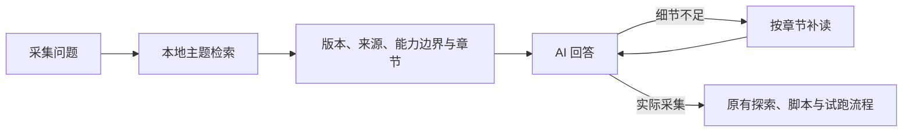

# 采集知识库维护

## 文件与职责

| 位置（相对仓库根） | 职责 |
| --- | --- |
| backend/ai_knowledge/collection_index.md | 统一定位、工具状态和主题导航 |
| backend/ai_knowledge/drissionpage/ | 概要、runtime.md 平台规则、catalog.md 导航、reference/ 下 59 篇原生参考文档；DP 执行器为可选原生方案 |
| backend/ai_knowledge/scrapling/ | 13 个主题的 Markdown 参考资料 |
| scripts/import_drissionpage_knowledge.py | 只读导入用户资料，清理广告与示例密钥，重建目录和哈希清单 |
| backend/app/ai_knowledge.py | 中文片段与英文术语检索、章节读取、来源信息、初始参考包 |
| backend/app/ai_tools.py | 注册 search_knowledge/read_knowledge 工具 |
| backend/app/ai_agent.py | 采集相关轮次自动检索、回答规则、上下文压缩 |
| backend/tests/test_ai_knowledge.py | 检索效果、章节、范围、来源与例子检查 |

## 资料基准

依据上游 [v0.4.15 固定提交](https://github.com/D4Vinci/Scrapling/tree/333fa22b7a5821194ce66b59b11f4b16a6484f02) 自行整理中文说明和合成示例。每篇的来源链接固定到提交，避免 latest 文档更新后混淆版本；原生能力再与本项目 ai_scraping、ai_browser、collection_api 等实际接口对照。

DrissionPage 现有简要说明参考过官网 4.1.1.4；本轮用户提供的 Markdown 首页明确标注 4.1.1.2，59 篇导入正文保持此版本。每篇返回 source_path 与 source_sha256，manifest.json 记录全部 64 篇原文件哈希、59 篇输出哈希和 5 篇排除理由。官方对应章节为可变网页，不能声称已固定到上游提交。只收录独立整理的摘要和导航，不混用 5.0 测试版 API。

知识文档不是上游文档的整站镜像，不自动联网更新，不执行文档代码，不增加原生引擎权限，也不升级运行依赖。网站历史观察仍单列，不能作为今日可用性结论。

## 检索与预算

- search_knowledge 按二至四级标题切章节，保留父级标题，代码围栏里的标题不切分，支持中文相邻字片段、英文 API 名和主题别名。原问题用词与 API 精确匹配优先于别名扩展；英文别名按词边界匹配，避免 SessionPage 被误当普通 session。零匹配返回空，不回填无关文档。
- 明确提到 Scrapling、DrissionPage / DP / SessionPage 时提高对应工具章节排序；不指定工具时按主题检索。首次参考包附总索引定位与所提工具的概览，比较问题附双方概览。无工具名默认附当前 Scrapling 适配边界。
- 默认最多 4 个结果、每篇最多 2 个章节，内容总量最多 9000 字符。章节分段最多 3600 字符，明确标记继续读取；工具返回 name、section、版本、范围、来源、library（工具）、integration（接入状态）、topics（主题）和截断状态。
- read_knowledge 用 name 和 section 读取；section 为空返回章节目录。只允许知识目录内已有 Markdown，不读取任意路径。
- 采集相关轮次的首次模型请求会附带能力边界和相关章节；细节可继续调用工具。原模型用量与时长限制仍生效，不消耗额外联网或嵌入模型调用。
- 压缩旧知识时保留来源、版本与章节编号，标记内容截断。未实现向量检索或自动抓取用户网站进库。

## 新增与更新

1. 新建主题 Markdown，使用一级标题，并注明“工具：”“接入状态：”“主题：”“版本：”“核对日期：”“适用范围：”；“来源：”后附官方文档的 Markdown 链接，地址使用 HTTPS。正文用二级标题分主题，关键词与元数据不代替实际解释。
2. 更新 collection_index.md 的工具及主题链接，保持未收录、仅参考、已有受控适配的区别。缺失元数据返回“未标注”，不能解释为已接入。核对原生接口与平台包装接口，示例注明运行环境和占位选择器；原生新功能未集成时明确写出。
3. 从真实提问增加检索用例。升级依赖时核对固定提交、API 和示例，不仅修改版本文字。
4. 在隔离副本运行知识与 Agent 测试；改动涉及工具与 Agent 时执行全套回归。同步 [负责人说明](../功能地图/采集知识库.md)。

验证记录见 [采集知识库验证](../采集知识库验证_2026-09-11.md)。

## 重新导入本地 DrissionPage 资料

在仓库根运行 `python scripts/import_drissionpage_knowledge.py "本地资料目录"`。脚本不导入平台 app，不执行示例、不修改源目录；仅生成 drissionpage/reference、catalog.md、manifest.json。知识库不依赖原目录在部署机器上存在。生成的 reference 文件固定 LF 换行，.gitattributes 保持跨系统检出时输出哈希一致。

导入保留技术正文、参数表、注意事项和代码；去除站点 front matter、广告、图片占位和行尾空白，远程连接示例密钥改为 EXAMPLE_KEY，原文 atuo_port 拼写改为 auto_port。图片仅留下原文提示，不宣称已理解图示。原目录混入的通知代码随重建索引排除，不传播到知识库。

ports.md 属于人工维护的项目说明，不被导入脚本覆盖。原文 auto_port 多进程描述存在差异，已在该说明中列出，不替上游消除不确定性。升级资料后检查 manifest 新旧差异；源目录减少文件时，核对并移除不再收录的旧 reference 文件，完整性测试会发现多余文件。
