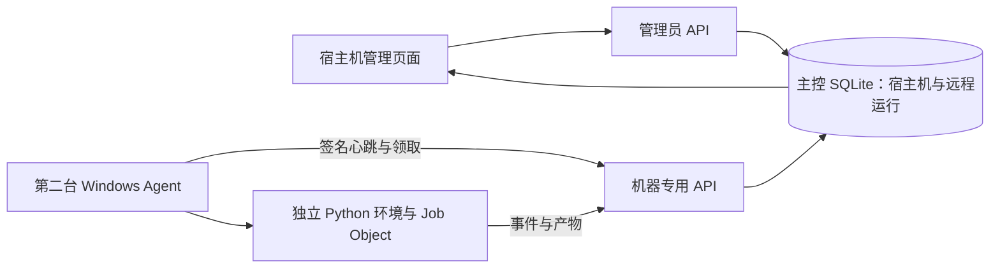
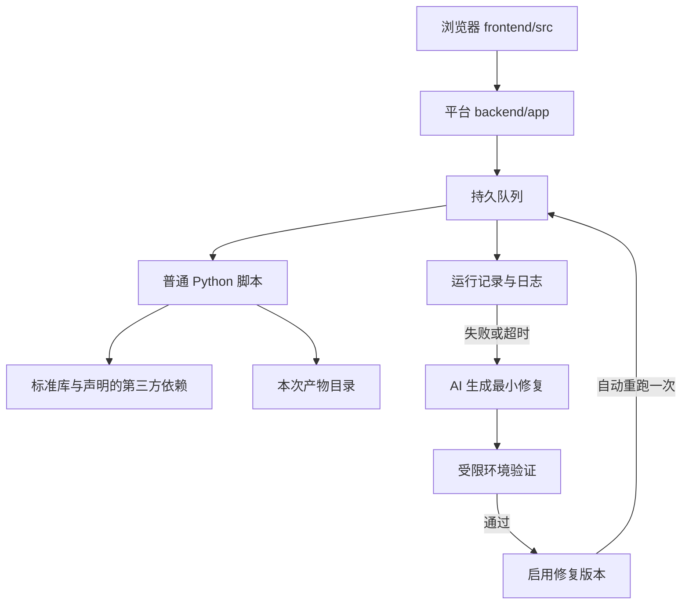

# SpiderFly 项目架构

平台负责调度和运行记录，普通 Python 脚本负责业务。项目不再维护指令块、专用文件处理运行库或本地 wheel 安装层。

## 当前多宿主机增量

2026-09-20 工作区新增独立远程链路，尚未发布或加载到正式服务：浏览器管理宿主机、主控持久保存远程运行、Windows Agent 主动领取指定任务并回传日志与结果。数据库、AI 和知识库仍只在主控。

远程运行冻结普通脚本和依赖快照，不调用旧本机执行队列或旧自动修复。stdout 中的结构化采集进度由主控持久化；失败或超时立即形成管理员站内提醒，按任务开关发送一次飞书摘要，并由独立远程维护队列生成未运行 AI 参考候选，管理员确认后才启用并向原宿主机创建新运行。每天/每周任务可固定计划宿主机，到点后冻结版本和目标并进入对应机器队列；未绑定宿主机的计划仍走旧本机队列。Agent 已有当前用户托盘和顶部状态条；当前不含全局运行看板。旧主控与 Agent 生产入口共用机器互斥锁，暂不支持主控电脑同时运行 Agent。

主控入口为 `api/hosts.py`，身份/租约/事件/产物在 `services/host_dispatch.py`，Agent 位于独立 `agent/`，页面为 `features/hosts/`。能力边界见[宿主机与远程运行](功能地图/宿主机与远程运行.md)，协议见[Agent 协议 v1](Agent协议_v1.md)，验证见[首增量记录](多宿主机首增量验证_2026-09-20.md)。

## 既有单机职责与依赖

| 位置 | 职责 | 边界 |
| --- | --- | --- |
| `frontend/src` | 用户操作和状态展示 | 不承担调度或业务计算 |
| `backend/app` | 账号、任务、环境、队列、版本、AI、通知 | 不加入订单筛选或金额计算规则 |
| `backend/sandbox` | AI 候选与受限任务验证 | 只开放已声明的环境能力 |
| `backend/ai_knowledge` | AI 编写脚本时使用的知识 | 不承担业务执行 |
| `examples`、`sample_scripts` | 普通 Python 示例 | 不依赖项目私有业务包 |
| `backend/tests` | 平台回归检查 | 在隔离副本执行 |

## 任务与环境

每个任务上传一个 `.py` 文件，按实际需要填写 PyPI 依赖。平台创建独立虚拟环境，安装依赖并检查解释器和依赖一致性。纯标准库脚本无需依赖。

输入模板路径由 `SPIDERFLY_TEMPLATE_FILE` 提供，下载文件写入 `SPIDERFLY_ARTIFACT_DIR`。可选结果回执使用 `SPIDERFLY_RESULT_FILE`。业务脚本自行处理输入、计算和保存，不修改原模板。标准库示例见 [task_template.py](../examples/task_template.py)。

旧指令包与衍生运行库、wheel、安装分支、业务示例和手册已删除。依赖清单遇到已移除的保留包名会明确拒绝，避免误装公网同名包。已上传的任务和运行数据不自动改写；依赖旧包的任务须通过任务版本入口换成普通脚本。

## 既有单机 AI 遇错自动修复

以下是旧单机链路尚未迁移的实现，不是多宿主机最终规则。新需求只允许 AI 生成候选，经管理员确认才启用并创建新运行，详见[多宿主机需求](多宿主机调度需求.md)。

执行失败或超时后，平台保留原错误并自动创建维护记录。AI 根据冻结的源码、需求、输入和错误生成最小修复；验证通过后自动启用版本，并在同一事务中安排一次重跑。重跑失败不会再次自动修复，避免循环。

没有验收声明的普通脚本，也必须先复现同一错误再验证修复。不能靠删业务逻辑、吞异常或放宽验收通过。失败、停止、预算不足和不支持的环境均保留明确状态。

需先配置 AI 服务并准备 WSL readonly-v1 / collection-v1。Windows 桌面软件、未支持依赖和未知副作用无法直接自动验证；这种情况下不启用未验证代码。设置、用量、停止与回退见 [自动修复说明](自动修复.md)。

`runner.py` 执行任务，`services/execution_queue.py` 串行 worker 触发维护，`maintenance.py` 负责生成、验证、版本发布和重跑，`maintenance_runtime.py` 负责受限环境。人工修改版本由 `task_versions.py` 管理。

## 维护边界

`main.py` 负责组装，接口位于 `api/`，队列和生命周期位于 `services/`。`App.vue` 组装导航与页面，功能视图和操作位于 `frontend/src/features/`，共享刷新与状态组装位于 `frontend/src/workspace/`。负责人先看 [功能地图](功能地图/README.md)，开发人员查 [代码对照](开发/代码对照与拆分方案.md)。AI、版本和维护的内部实现未在本轮全面拆分。

正式数据和任务版本只能通过平台流程维护；修改仓库示例不会替换已上传任务。详细约束见 [AGENTS](../AGENTS.md) 和 [任务执行约定](任务执行约定.md)。
