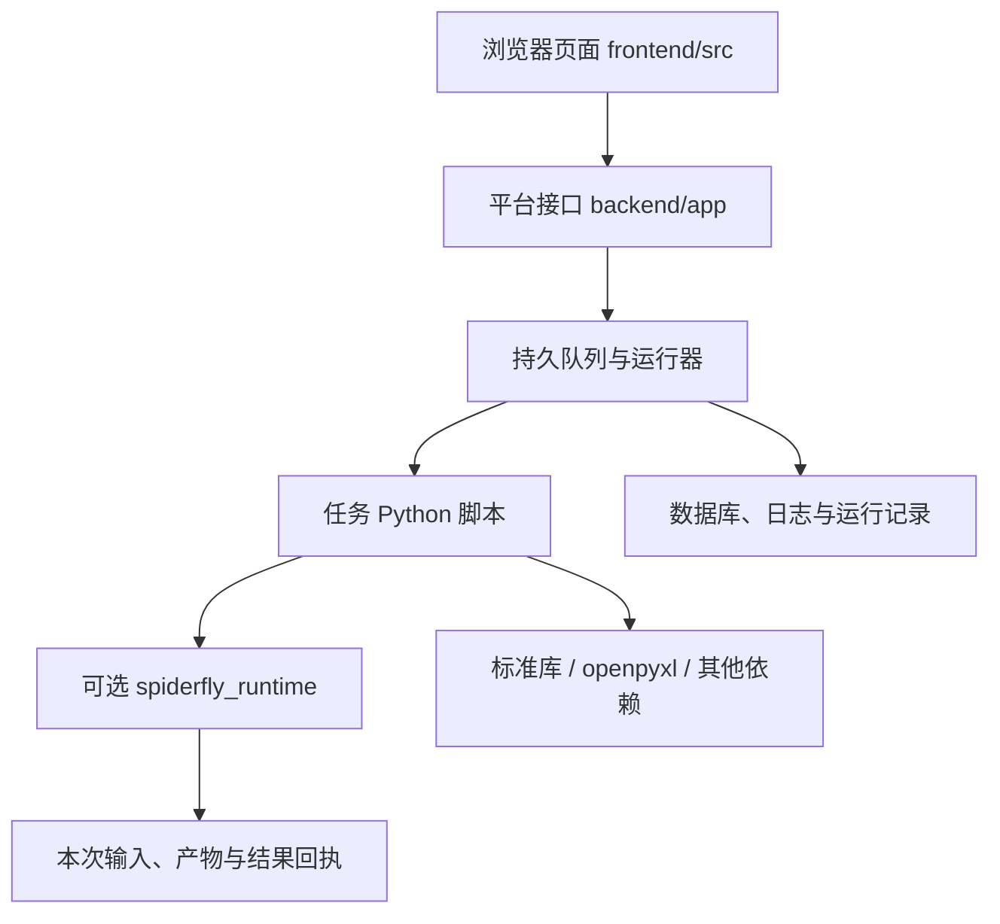

# SpiderFly 项目架构

平台接收并串行运行 Python 脚本。业务规则只在脚本中维护；Excel 是脚本可以处理的一种输入，不是平台的指令系统。

## 职责与依赖

| 位置 | 职责 | 边界 |
| --- | --- | --- |
| `frontend/src` | 用户操作与状态展示 | 不承担调度或业务计算 |
| `backend/app` | 账号、任务、队列、环境、版本、AI 和通知 | 不加入订单筛选、金额计算等业务规则 |
| `backend/spiderfly_runtime` | 可选输入输出辅助与普通文件处理函数 | 不导入 app、数据库或业务示例，不注册指令 |
| `flows` | 当前维护的单文件业务脚本 | 可以单独上传，条件和计算规则写在脚本里 |
| `examples` | 冻结版本的兼容入口、特殊环境模板 | 旧入口维持原依赖，不作为新业务开发起点 |
| `release/runtime` | 当前运行库 wheel | 新任务显式声明所需版本 |
| `release/instructions` | 冻结的旧指令包 wheel | 仅兼容 0.1.0–0.1.4 任务，不覆盖、不升级 |
| `backend/tests` | 新运行库、平台和旧版本兼容回归 | 旧指令测试从已安装旧 wheel 导入 |

## 运行库

`task.py` 只负责本次输入副本、产物目录和回执；`errors.py` 提供错误类型，二者不加载表格依赖或服务器。

`excel.py`、`excel_write.py`、`table_filter.py`、`average.py` 和 `files.py` 提供具名函数。保留必要的列名、类型、原文件保护与保存结果检查；`_validation.py` 是这些函数的内部校验辅助。

调用示例：`read_excel(path, required_columns=["状态"])`。不再创建 Registry、注册指令或通过字符串查找处理器。普通脚本也可以完全不用运行库，直接使用 Python 第三方库并按平台约定生成结果。

## 本地依赖安装

`backend/app/local_packages.py` 识别两个保留包名，检查固定版本，并解析本地 wheel。`environments.py` 负责创建环境、执行安装和验证。

缺少 wheel 时在安装前报错，不向公网回退查找同名包。新运行库验证实际模块和发行版本，不再依赖 `example_flows` 业务模块。旧任务继续使用冻结 wheel，已上传源码、已建环境和历史版本不自动迁移。

## 业务开发

1. 从 `flows/template.py` 创建单文件脚本，依赖按实际使用填写。
2. 条件、字段和计算放在业务文件中；多处确实复用的文件处理才进入运行库。
3. 产物写入本次目录，失败明确保留错误，不覆盖原输入。
4. 在隔离副本验证，再经平台任务与版本入口上传。

当前运行库用于普通 Windows Python 任务；WSL 受限环境尚未安装它。AI 生成的受限脚本继续使用对应环境支持的依赖，不能据此扩大自动维护范围。

## 本次重构范围

移除旧指令框架源码和打包的重复业务实现；从已验证的实现提取普通函数，运行库 wheel 不包含业务示例。平台调度、AI、账号和前端行为保持现有职责。

`main.py` 和 `App.vue` 仍有较多职责集中在单个文件，这是后续可以独立处理的拆分项；本次没有把文件拆分与运行库迁移混在一起。
